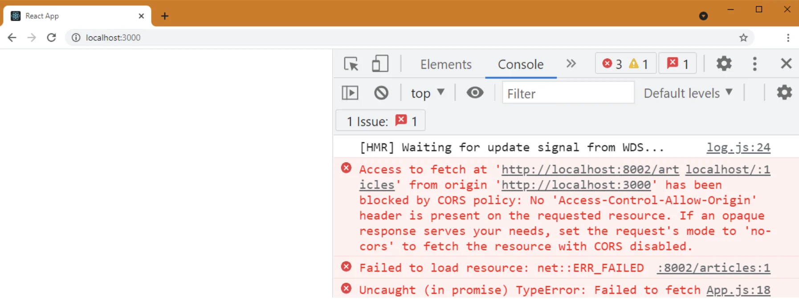
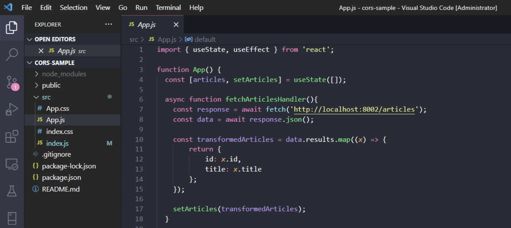
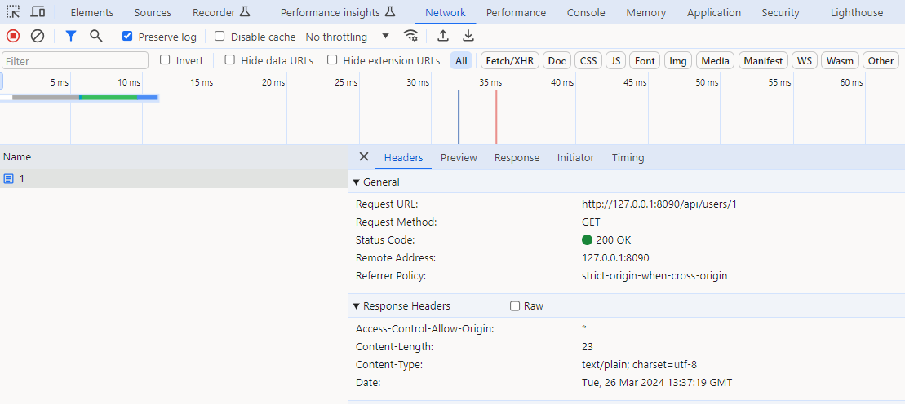

# Cross Origin Resource Sharing (CORS)

Whilst you can Post and Get to your API when running locally, when you run your server remotely (Azure, AWS, GCP, etc) then you will almost certainly run into problems with CORS problems that don't allow you front end to connect to your back end.

And in your console will be cryptic messages about "CORS".



## What is it?

CORS stands for Cross-Origin Resource Sharing. It's a standard web mechanism, based on HTTP headers, that enables a given web server to indicate other origins that are allowed to load resources from it.

## Why?

Well, it's like this - what if you don't want *anyone and everyone* to access your server? Well, you can allow access to everyone, only certain domains, or only for those operating from the same origin.

### Origins?

An origin serves as a fundamental security boundary in web browsers, delineating resources from distinct sources. It comprises three components: the communication protocol (e.g., HTTP or HTTPS), the network port, and the host domain. 

For instance, https://www.example.com:443 and https://www.example.com share the same origin due to their congruent protocol, port, and domain. Conversely, https://example.com and http://example.com are distinct origins owing to protocol disparity.

### same-origin

The same-origin policy, inherent to web browsers, is a protective measure preventing unauthorized access to resources across different origins. Scenarios arise wherein legitimate cross-origin resource sharing is necessary. 

Consider a scenario wherein disparate components of an application—such as a backend service written in Java and a frontend interface developed in Angular—are hosted on disparate domains. Facilitating seamless communication between these components necessitates *circumventing* the same-origin policy. 

CORS serves as a mechanism for *explicitly* permitting such interactions by establishing an allow-list of permissible origins. By doing so, it authorizes cross-origin requests from designated sources while maintaining security integrity.

## In action

> From https://www.stackhawk.com/blog/golang-cors-guide-what-it-is-and-how-to-enable-it/

`git clone https://github.com/carlosschults/cors-sample`

Then, access the folder and start the project using npm:
```
cd cors-sample
npm start
```

Point your browser at http://localhost:3000 and make sure to activate the developer tools in your browser to see the error!

### Understanding the problem

If you open the contents of the folder you've just cloned using your favorite text editor, you'll see something like this:



This app is a React application that consumes—or at least tries—the JSON returned by the Golang app, converts it to an array of objects, and renders them on the screen.

But, as you could see, that's not working. Why?

The answer is, as you probably suspect, the same-origin policy. The Golang app runs on port **8002**. However, the client React app runs on port **3000**. As you've seen, simply having different port numbers is already enough for two URLs to be considered different origins. 

## How do we solve it?

The first thing to know is that CORS is always server-side. Always. Beware the articles telling you to add Chrome extensions or change the headers your client is sending.

The second thing is that if we want to allow access from another origin, we have to apply that to all our responses as a *header*.

There are multiple ways you can do this.

1. The most long-winded way is to add `writer.Header().Set("Access-Control-Allow-Origin", "*")` to every single function that handles a request. 
2. Another function that allows you to write less code, but you still have to call it in every function that deals with a request.
3. Middleware, that sits between *all* requests and responses, and adds the header automatically to every response.

Obviously, option 3 seems most sane and stops us writing code again and again.

## Middleware

Middleware - in the context of web development - refers to a software layer that sits between the client (the browser for instance) and the main application logic, intercepting and processing incoming requests *before* they reach the handlers, or modifying the *response* before it is finally sent back.

So middleware is either the first thing that happens to a request before it reaches the handler, or the last thing that happens before a response is sent back, and can modify the request or response. It's useful for things like logging, authentication, authorization, and, of course, CORS.


Let's write our own middleware within out `main.go` file:

```go
func CorsMiddleware(next http.Handler) http.Handler {
    return http.HandlerFunc(func(writer http.ResponseWriter, request *http.Request) {
        writer.Header().Set("Access-Control-Allow-Origin", "*")
        // Continue with the next handler
        next.ServeHTTP(writer, request)
    })
}
```

This code will add one new header to the `writer`, which is what we use to send information back in all our handlers.

> "Access-Control-Allow-Origin" - here we are setting in to "*" which means "allow access from anywhere".

BUT, we're still not quite ready to go. To do so we'll need to instruct our multiplexer to use the function in our `main()` like so:

```go
err := http.ListenAndServe(":8080", CorsMiddleware(router))
```

If you want to check, you can now see the access control origin in the response from any of your requests. Here's one from my GET request for a single user:



---

## Packages

Of course there are packages you can use to do this too, one of which is https://github.com/rs/cors, but if you ever find yourself needing to modify requests or responses, you'll probably end up writing your own middleware at some point.

---

[Part 7 - Refactoring Our Code >>](/Part7/refactoring_our_code.md)

